# CCIP Canton Contracts

This document describes the Daml smart contract architecture for Chainlink CCIP (Cross-Chain Interoperability Protocol)
on Canton.

## Contract artifacts & releases

DARs live under:

- `contracts/dars/dev` for development artifacts, rebuilt on every contract change
- `contracts/dars/released` for stable, immutable, release versions

While the `/released` DARs are release candidates that are about to be released, artifacts **must only be acquired from
tagged GitHub releases**. The latest `contracts/v<x.y.z>` release is considered released, and is the only version that
should be used in production.
See [Releases](https://github.com/smartcontractkit/chainlink-canton/releases?q=contracts%2F&expanded=true) for the
latest available version.

Go bindings live under `contracts/bindings/generated/`, enforced to be up-to-date with `/dev` DARs. For details on the
Go bindings themselves, see **[bindings/README.md](./bindings/README.md)**.

## Overview

CCIP Canton enables cross-chain messaging between Canton and other blockchain networks (EVM, Solana, Aptos, SUI, TVM).
Unlike EVM-based CCIP which supports arbitrary execution via `ccipReceive()` callbacks, Canton CCIP provides **arbitrary
messaging** - users receive verified message data and decide how to process it.

### Key Differences from EVM CCIP

| Aspect              | EVM CCIP                          | Canton CCIP                               |
|---------------------|-----------------------------------|-------------------------------------------|
| Execution model     | Arbitrary execution via callbacks | Arbitrary messaging (user processes data) |
| Receiver            | Contract address                  | PartyId encoded as bytes                  |
| Message retrieval   | Automatic callback                | User fetches from off-chain storage       |
| State model         | Global shared state               | Per-party isolated state (PerPartyRouter) |
| Contract visibility | Public                            | Explicit disclosure required              |
| Risk management     | RMN pausing per lane              | RMN curse mechanism (global + per-chain)  |
| Message execution   | Single destination executor       | Pluggable Executor interface              |

## Architecture

### Layered Design

CCIP Canton contracts are organized in a modular, layered architecture:

```
   ┌────────────────────────────────────────────────────────────────────────┐
   │             USER TIER (not CCIP-owned)                                 │
   │              - CCIPSender (outbound orchestrator)                      │
   │              - CCIPReceiver (inbound orchestrator)                     │
   └────────────────────────────────────────────────────────────────────────┘
     │ ClientV1 interface                       extension-api interfaces │
     ▼                                                                   ▼
┌─────────────────────────────────────────────────┐ ┌─────────────────────────┐
│ RUNTIME TIER (runtime)                          │ │ THIRD-PARTY TIER        │
│  - PerPartyRouter (per-user state & routing)    │ │  - Executor             │
│  - OnRamp (outbound message processing)         │ │  - CommitteeVerifier    │
│  - OffRamp (inbound message processing)         │ │  - Token Pools          │
└─────────────────────────────────────────────────┘ └─────────────────────────┘
    │ direct calls                                       apiv1 interfaces │
    ▼                                                                     ▼
  ┌──────────────────────────────────────────────────────────────────────────┐
  │ CORE TIER (core)                                                         │
  │  - GlobalConfig (chain & lane configs)                                   │
  │  - TokenAdminRegistry (token & ticket authority)                         │
  │  - FeeQuoter (fee calculations)                                          │
  │  - RMNRemote (risk management & curse mechanism)                         │
  │  - SendingMessage, ExecutingMessage (message state)                      │
  └──────────────────────────────────────────────────────────────────────────┘
```

### Contract Categories

**SHARED CONTRACTS** (fetched via explicit disclosure):

- `GlobalConfig` — chain & lane configuration
- `TokenAdminRegistry` — token pool registry & ticket authority
- `FeeQuoter` — fee calculation engine
- `RMNRemote` — risk management with curse mechanism
- `OnRamp`, `OffRamp` — message sending/receiving logic
- CCVs (e.g., `CommitteeVerifier`) — cross-chain message verifiers
- `Executor` — message execution wrapper for destination chains

**PER-PARTY CONTRACTS** (user is stakeholder):

- `PerPartyRouter` — isolated state container per user
    - `outboundSequenceNumbers` : Map destChain → seqNum
    - `executedMessages` : Set messageHash (with archive pattern for scaling)
    - `customObservers` : [Party] for optional observers

**TICKETS** (ephemeral, created and consumed during flows):

- `TokenReceiveTicket` — authorizes token release on inbound
    - Factory-created via `TokenAdminRegistry`

## Security Considerations

### DAR Vetting

CCIP on Canton relies heavily on Daml interfaces (e.g. `CCIP.APIV2.RMNRemote.IRMNRemote`,
`CCIP.APIV2.TokenPool.ITokenPool`, `CCIP.APIV2.TokenFactory.ITokenFactory`, `CCIP.APIV2.CCV.ICCV`, etc.) to decouple the
core protocol from third-party implementations such as token pools, token factories, and CCVs. Contracts are referenced
across trust boundaries by their interface, and in some cases by `ContractId`s that are resolved dynamically at runtime
rather than being hardcoded into the core contracts.

This design has an important consequence: **Daml provides no way to inspect the signatory or the implementing package of
a contract behind an interface at runtime.** When a token pool calls into an `IRMNRemote`, or CCIP dispatches to an
`ITokenFactory` / `ICCV`, the caller inherently trusts that the contract behind the interface is a legitimate
implementation. It is not possible to enforce this on-ledger.

The only line of defense is therefore **package vetting** on the participant node:

- On Canton, a package (DAR) must be explicitly *vetted* by a participant operator before any contracts from that
  package can be created or exercised on that participant. Vetting is a security-critical, privileged operation (see the
  [Canton glossary entry on Vetting](https://docs.canton.network/overview/understand/glossary#vetting)).
- If a malicious DAR that implements one of the CCIP interfaces (e.g. a forged `IRMNRemote`, a malicious
  `ITokenFactory`, or a rogue `ICCV`) is vetted on a participant that runs CCIP-related parties, the entire trust model
  breaks down — a token pool could unknowingly call into an attacker-controlled `RMNRemote` and receive forged
  validation results, or accept a spoofed transfer ticket from a malicious factory.

**Operator responsibilities.** Anyone operating a participant node that hosts CCIP-related parties — Chainlink, Node
Operators (NOPs), token issuers, and token pool owners — MUST:

1. Only vet DARs that they have independently verified and trust. In particular, no third-party implementation of any
   CCIP interface (`IRMNRemote`, `ICCV`, `ITokenPool`, `ITokenFactory`,
   `ITokenAdminRegistry`, etc.) may be vetted unless it has been explicitly reviewed and approved.
2. Treat DAR vetting as a privileged, audited operation. It should never be delegated to untrusted parties or automated
   based on external input.
3. Keep vetting scoped: only vet the packages actually required to operate the participant's parties.

**Out of scope for the security model.** Any exploit that requires an attacker to upload and vet a forged or malicious
DAR on a Chainlink, NOP, or token pool owner participant is considered **out of scope**. Such an attack presupposes that
the attacker has already compromised the elevated privileges required to vet packages on that node, at which point the
participant itself is compromised and all CCIP-level guarantees are void. This is consistent with Canton's fundamental
security principle that operators have full control over — and full responsibility for — the code that runs on their
validators.

## Package Structure

```
contracts/ccip/
├── api/                    # API interfaces (APIV1) — public contract signatures
│   └── daml/CCIP/APIV2/
│       ├── GlobalConfig.daml       # Configuration interface
│       ├── ExecutingMessage.daml   # Inbound message processing
│       ├── SendingMessage.daml     # Outbound message processing
│       ├── FeeQuoter.daml          # Fee calculation interface
│       ├── RMNRemote.daml          # Risk management interface
│       └── TokenAdminRegistry.daml # Token authority interface
├── core/                   # Core implementations (CoreV2)
│   └── daml/CCIP/CoreV2/
│       ├── GlobalConfig.daml       # Chain & lane configuration
│       ├── TokenAdminRegistry.daml # Token pool registry & ticket authority
│       ├── FeeQuoter.daml          # Fee calculation engine
│       ├── RMNRemote.daml          # Risk management with curse mechanism
│       ├── SendingMessage.daml     # Outbound message state machine
│       └── ExecutingMessage.daml   # Inbound message state machine
├── runtime/                # Runtime layer (RuntimeV2) — message processing
│   └── daml/CCIP/RuntimeV2/
│       ├── PerPartyRouter.daml     # Per-user state & routing (+ factory)
│       ├── OnRamp.daml             # Outbound message processing
│       └── OffRamp.daml            # Inbound message processing
├── sender/                 # Sender-side orchestrator (user-owned)
│   └── daml/CCIP/
│       └── CCIPSender.daml         # Outbound orchestration & fee finalization
├── receiver/               # Receiver-side orchestrator (user-owned)
│   └── daml/CCIP/
│       └── CCIPReceiver.daml       # Inbound orchestration & CCV threading
├── executor/               # Message executor (extensible)
│   └── daml/CCIP/ExecutorV2/
│       └── Executor.daml           # Remote chain execution wrapper
├── committee-verifier/     # CCV implementation — committee ECDSA
│   └── daml/CCIP/CommitteeVerifierV2/
│       ├── CommitteeVerifier.daml  # Committee-based signature verification
│       └── Crypto/                 # DER encoding & signature validation
├── extension-api/          # Extension interfaces for pluggable components
│   └── daml/CCIP/InterfacesV2/
│       ├── CrossChainVerifier.daml # ICrossChainVerifier interface
│       ├── TokenPool.daml          # ITokenPool interface
│       └── Executor.daml           # IExecutor interface
├── codec/                  # Message encoding & cryptographic utilities
│   └── daml/CCIP/CodecV2/
│       ├── MessageCodecV2.daml     # MessageV1 encoding (EVM-compatible)
│       ├── CCVCodec.daml           # CCV attestation encoding
│       ├── FinalityConfig.daml     # Finality policy encoding
│       ├── Math.daml               # Numeric utilities
│       └── Uint256.daml            # 256-bit integer handling
├── tickets/                # Ticket templates
│   └── daml/CCIP/
│       └── TicketsV2.daml          # TokenReceiveTicket definition
├── client/                 # Client interfaces for applications
│   └── daml/CCIP/
│       └── ClientV2.daml           # Public-facing PerPartyRouter interface
├── events/                 # Event contracts for off-chain observation
│   └── daml/CCIP/EventsV2/
│       ├── Events.daml             # CCIPMessageSent, ExecutionStateChanged
│       └── Receipts.daml           # Event receipts
├── pools/                  # Reference token pool implementations
│   ├── lock-release-token-pool/    # Lock-release pool implementation
│   └── burn-mint-token-pool/       # Burn-mint pool implementation
├── rate-limiter/           # Rate limiting contracts
├── factory/                # Factory for contract deployment
│   └── daml/CCIP/
│       └── FactoryV2.daml          # Contract deployment factory
├── test/                   # Test contracts & mocks
│   └── daml/CCIP/
│       └── *Test.daml              # Unit & integration tests
└── utils/                  # Utility modules
    └── daml/CCIP/
        └── UtilsV2/                # Common helpers
```

### Package imports

```mermaid
flowchart BT
%% Splice
    splice-metadata-v1
    splice-holding-v1
    splice-burn-mint-v1
    splice-transfer-instruction-v1
%% Chainlink API
    chainlink-api
%%& MCMS
    mcms-api
    mcms-core
    mcms-core --> chainlink-api
    mcms-core --> mcms-api
%% CCIP API
    ccip-api-v2
    ccip-api-v2 --> splice-metadata-v1
    ccip-api-v2 --> splice-holding-v1
    ccip-api-v2 --> splice-burn-mint-v1
    ccip-api-v2 --> splice-transfer-instruction-v1
    ccip-api-v2 --> chainlink-api
    ccip-api-v2 --> ccip-codec-v2
%% CCIP Client API
    ccip-client-api-v2
    ccip-client-api-v2 --> splice-metadata-v1
    ccip-client-api-v2 --> splice-holding-v1
    ccip-client-api-v2 --> splice-burn-mint-v1
    ccip-client-api-v2 --> splice-transfer-instruction-v1
    ccip-client-api-v2 --> chainlink-api
    ccip-client-api-v2 --> ccip-codec-v2
    ccip-client-api-v2 --> ccip-events-v2
    ccip-client-api-v2 --> ccip-tickets-v2
    ccip-client-api-v2 --> ccip-extension-api-v2
%% CCIP Codec
    ccip-codec-v2
    ccip-codec-v2 --> chainlink-api
    ccip-codec-v2 --> mcms-api
%% CCIP CommitteeVerifier
    ccip-committee-verifier-v2
    ccip-committee-verifier-v2 --> splice-metadata-v1
    ccip-committee-verifier-v2 --> splice-holding-v1
    ccip-committee-verifier-v2 --> splice-burn-mint-v1
    ccip-committee-verifier-v2 --> splice-transfer-instruction-v1
    ccip-committee-verifier-v2 --> chainlink-api
    ccip-committee-verifier-v2 --> mcms-api
    ccip-committee-verifier-v2 --> ccip-codec-v2
    ccip-committee-verifier-v2 --> ccip-api-v2
    ccip-committee-verifier-v2 --> ccip-extension-api-v2
%% CCIP Core
    ccip-core-v2
    ccip-core-v2 --> splice-metadata-v1
    ccip-core-v2 --> splice-holding-v1
    ccip-core-v2 --> splice-burn-mint-v1
    ccip-core-v2 --> splice-transfer-instruction-v1
    ccip-core-v2 --> chainlink-api
    ccip-core-v2 --> mcms-api
    ccip-core-v2 --> ccip-api-v2
    ccip-core-v2 --> ccip-tickets-v2
    ccip-core-v2 --> ccip-codec-v2
    ccip-core-v2 --> ccip-events-v2
%% CCIP Events
    ccip-events-v2
    ccip-events-v2 --> splice-metadata-v1
    ccip-events-v2 --> splice-holding-v1
    ccip-events-v2 --> splice-burn-mint-v1
    ccip-events-v2 --> splice-transfer-instruction-v1
    ccip-events-v2 --> chainlink-api
    ccip-events-v2 --> mcms-api
    ccip-events-v2 --> ccip-api-v2
    ccip-events-v2 --> ccip-codec-v2
%% CCIP Executor
    ccip-executor-v2
    ccip-executor-v2 --> splice-metadata-v1
    ccip-executor-v2 --> splice-holding-v1
    ccip-executor-v2 --> splice-burn-mint-v1
    ccip-executor-v2 --> splice-transfer-instruction-v1
    ccip-executor-v2 --> chainlink-api
    ccip-executor-v2 --> mcms-api
    ccip-executor-v2 --> ccip-api-v2
    ccip-executor-v2 --> ccip-codec-v2
    ccip-executor-v2 --> ccip-extension-api-v2
%% CCIP Extension API
    ccip-extension-api-v2
    ccip-extension-api-v2 --> splice-metadata-v1
    ccip-extension-api-v2 --> splice-holding-v1
    ccip-extension-api-v2 --> splice-burn-mint-v1
    ccip-extension-api-v2 --> splice-transfer-instruction-v1
    ccip-extension-api-v2 --> chainlink-api
    ccip-extension-api-v2 --> ccip-api-v2
%% CCIP BurnMintTokenPool
    ccip-burn-mint-token-pool-v2
    ccip-burn-mint-token-pool-v2 --> splice-metadata-v1
    ccip-burn-mint-token-pool-v2 --> splice-holding-v1
    ccip-burn-mint-token-pool-v2 --> splice-burn-mint-v1
    ccip-burn-mint-token-pool-v2 --> splice-transfer-instruction-v1
    ccip-burn-mint-token-pool-v2 --> chainlink-api
    ccip-burn-mint-token-pool-v2 --> mcms-api
    ccip-burn-mint-token-pool-v2 --> ccip-api-v2
    ccip-burn-mint-token-pool-v2 --> ccip-tickets-v2
    ccip-burn-mint-token-pool-v2 --> ccip-codec-v2
    ccip-burn-mint-token-pool-v2 --> ccip-utils-v2
    ccip-burn-mint-token-pool-v2 --> ccip-events-v2
    ccip-burn-mint-token-pool-v2 --> ccip-rate-limiter-v2
    ccip-burn-mint-token-pool-v2 --> ccip-extension-api-v2
%% CCIP LockReleaseTokenPool
    ccip-lock-release-token-pool-v2
    ccip-lock-release-token-pool-v2 --> splice-metadata-v1
    ccip-lock-release-token-pool-v2 --> splice-holding-v1
    ccip-lock-release-token-pool-v2 --> splice-burn-mint-v1
    ccip-lock-release-token-pool-v2 --> splice-transfer-instruction-v1
    ccip-lock-release-token-pool-v2 --> chainlink-api
    ccip-lock-release-token-pool-v2 --> mcms-api
    ccip-lock-release-token-pool-v2 --> ccip-api-v2
    ccip-lock-release-token-pool-v2 --> ccip-tickets-v2
    ccip-lock-release-token-pool-v2 --> ccip-codec-v2
    ccip-lock-release-token-pool-v2 --> ccip-utils-v2
    ccip-lock-release-token-pool-v2 --> ccip-events-v2
    ccip-lock-release-token-pool-v2 --> ccip-rate-limiter-v2
    ccip-lock-release-token-pool-v2 --> ccip-extension-api-v2
%% CCIP RateLimiter
    ccip-rate-limiter-v2
    ccip-rate-limiter-v2 --> chainlink-api
    ccip-rate-limiter-v2 --> mcms-api
%% CCIP Runtime
    ccip-runtime-v2
    ccip-runtime-v2 --> splice-metadata-v1
    ccip-runtime-v2 --> splice-holding-v1
    ccip-runtime-v2 --> splice-burn-mint-v1
    ccip-runtime-v2 --> splice-transfer-instruction-v1
    ccip-runtime-v2 --> chainlink-api
    ccip-runtime-v2 --> mcms-api
    ccip-runtime-v2 --> ccip-api-v2
    ccip-runtime-v2 --> ccip-tickets-v2
    ccip-runtime-v2 --> ccip-core-v2
    ccip-runtime-v2 --> ccip-utils-v2
    ccip-runtime-v2 --> ccip-codec-v2
    ccip-runtime-v2 --> ccip-extension-api-v2
    ccip-runtime-v2 --> ccip-events-v2
    ccip-runtime-v2 --> ccip-client-api-v2
%% CCIP Tickets
    ccip-tickets-v2
    ccip-tickets-v2 --> splice-metadata-v1
    ccip-tickets-v2 --> splice-holding-v1
    ccip-tickets-v2 --> splice-burn-mint-v1
    ccip-tickets-v2 --> splice-transfer-instruction-v1
    ccip-tickets-v2 --> chainlink-api
    ccip-tickets-v2 --> ccip-api-v2
    ccip-tickets-v2 --> ccip-codec-v2
%% CCIP Utils
    ccip-utils-v2
    ccip-utils-v2 --> splice-metadata-v1
    ccip-utils-v2 --> mcms-api
%% LinkToken
    link
    link --> splice-metadata-v1
    link --> splice-holding-v1
    link --> splice-burn-mint-v1
    link --> splice-transfer-instruction-v1

```



## Core Contracts

### PerPartyRouter

Per-party routing and state container for sender and receiver flows. Each party gets their own router to avoid state
contention.

**Fields:**

```daml
template PerPartyRouter
    with
        instanceId : Text                              -- Unique identifier
        ccipOwner : Party                              -- CCIP system owner
        partyOwner : Party                             -- Message sender/receiver
        deps : PerPartyRouterDeps                      -- Dependency container
        outboundSequenceNumbers : Map (Numeric 0) (Numeric 0)  -- destChain → seqNum
        executedMessages : Set BytesHex                -- messageHash set (for replay detection)
        archivedExecutionContractIds : [ContractId ArchivedExecutedMessages]  -- archived message sets
        customObservers : [Party]                      -- Optional observers
        feeTransferLifetime : Optional RelTime
```

**Key Choices:**

- `GetSequenceNumber` — Query next sequence number for a destination chain
- `PrepareSend` — Initiate outbound message (creates SendingMessageV1)
- `GetFee` — Calculate total fee including CCVs, pool, executor, and network costs
- `FinalizeFee` — Apply fee to message and fee payment instruction
- `CCIPSend` — Finalize outbound message (creates CCIPMessageSent event)
- `PrepareExecute` — Initiate inbound message (creates ExecutingMessageV1)
- `GetRequiredCCVsForExecute` — Query final required CCVs for execution
- `Execute` — Finalize inbound message (creates ExecutionStateChanged event)
- `SetDeps` — (Factory) Update dependencies (MCMS-protected)

### OnRamp

Implements outbound message processing, called by `PerPartyRouter.CCIPSend`. Encodes messages, validates lane
configurations, collects CCVs, and issues `TokenSendTicket` if token transfer present.

**Fields:**

```daml
template OnRamp
    with
        instanceId : Text
        ccipOwner : Party
        maxUSDCentsPerMsg : Numeric 0
        deps : OnRampDeps  -- Includes GlobalConfig, FeeQuoter, RMNRemote
```

**Key Choices:**

- `GetRequiredCCVsForSendFromRouter` — Compute required CCVs for outbound lane
- `GetFeeFromRouter` — Calculate fee components (network, CCV, token pool, executor)
- `PrepareSendFromRouter` — Build SendingMessageV1 (message state machine)
- `FinalizeFeeFromRouter` — Apply fee to message and compute fee instructions
- `CCIPSendFromRouter` — Encode message, collect CCVs, create CCIPMessageSent event

### OffRamp

Implements inbound message processing, called by `PerPartyRouter.Execute`. Decodes messages, validates source chain
configs, collects CCVs, and issues `TokenReceiveTicket`.

**Fields:**

```daml
template OffRamp
    with
        instanceId : Text
        ccipOwner : Party
        deps : OffRampDeps  -- Includes GlobalConfig, RMNRemote, TokenAdminRegistry
```

**Key Choices:**

- `GetRequiredCCVsForExecuteFromRouter` — Compute required CCVs for inbound lane
- `PrepareExecuteFromRouter` — Decode message, build ExecutingMessageV1 (message state machine)
- `ExecuteFromRouter` — Validate CCVs, issue TokenReceiveTicket, create ExecutionStateChanged event

### GlobalConfig

Shared configuration for chain selectors and lane settings. Managed by `ccipOwner` via MCMS.

**Fields:**

```daml
template GlobalConfig
    with
        instanceId : Text
        ccipOwner : Party
        chainSelector : Numeric 0              -- This chain's identifier
        destChainConfigs : Map (Numeric 0) DestChainConfig   -- Outbound lanes
        sourceChainConfigs : Map (Numeric 0) SourceChainConfig -- Inbound lanes
```

**Key Choices:**

- `GetDestChainConfig` — Fetch destination chain configuration
- `GetSourceChainConfig` — Fetch source chain configuration
- `ApplyDestChainConfigUpdates` — Update outbound lane configs (MCMS-protected)
- `ApplySourceChainConfigUpdates` — Update inbound lane configs (MCMS-protected)

**DestChainConfig:**

```daml
data DestChainConfig = DestChainConfig
    with
        isEnabled : Bool                        -- Flag whether this destination chain is enabled or not.
        addressBytesLength : Int                -- The length of an address on this chain in bytes, e.g. 20 for EVM, 32 for SVM.
        tokenReceiverAllowed : Bool             -- Whether specifying `tokenReceiver` in extraArgs is allowed. Must be set to false for all EVM chains.
        baseExecutionGasCost : Int              -- Base destination-chain gas cost added to ccipReceiveGasLimit for execution pricing.
        offRampAddress : BytesHex               -- OffRamp address on the destination chain.
        defaultExecutor : Optional Chainlink.InstanceAddress.RawInstanceAddress -- Default executor to use for messages to this destination chain. `None` means no executor.
        laneMandatedCCVs : [Chainlink.InstanceAddress.RawInstanceAddress] -- Required CCVs to use for all messages to this destination chain.
        defaultCCVs : [Chainlink.InstanceAddress.RawInstanceAddress]      -- Default CCVs to use for messages to this destination chain.
        messageNetworkFeeUSDCents : Numeric 0   -- Network fee in USD cents for messages without token transfers.
        tokenNetworkFeeUSDCents : Numeric 0     -- Network fee in USD cents for messages with token transfers.
```

**SourceChainConfig:**

```daml
data SourceChainConfig = SourceChainConfig
    with
        isEnabled : Bool                        -- Flag whether the source chain is enabled or not.
        onRampAddresses : [BytesHex]            -- OnRamp addresses on the source chain.
        defaultCCVs : [Chainlink.InstanceAddress.RawInstanceAddress]      -- Default CCVs to use for messages from this source chain.
        laneMandatedCCVs : [Chainlink.InstanceAddress.RawInstanceAddress] -- Required CCVs to use for all messages from this source chain.
```

### TokenAdminRegistry

Central authority for token pool registration and `TokenReceiveTicket` issuance.

**Fields:**

```daml
template TokenAdminRegistry
    with
        instanceId : Text
        ccipOwner : Party
        entryCount : Int
```

**Key Choices:**

- `GetTokenConfig` — Query registered pool for a token
- `SetPool` — Register or unregister a pool for a token (admin-protected)
- `ConsumeReceiveTicket` — Consume ticket to release inbound tokens (pool + ccipOwner authority)
- `SetOutboundPoolCCVs` — Record pool's required CCVs for outbound transfers
- `SetInboundPoolCCVs` — Record pool's required CCVs for inbound transfers
- `ProposeAdministrator` / `AcceptAdminRole` — Two-step admin transfer (MCMS-protected)

### RMNRemote

Risk Management Network providing emergency stop capability via **curse mechanism** (matching EVM `RMNRemote.sol`).
Supports both global curses and per-chain curses.

**Fields:**

```daml
template RMNRemote
    with
        instanceId : Text              -- Unique identifier for this RMN instance
        rmnOwner : Party               -- Party controlling curse operations
        ccipOwner : Party              -- For deployment association/validation
        customObservers : [Party]      -- Additional parties allowed to observe RMN state
        cursedSubjects : [BytesHex]    -- Currently cursed subjects (global or chain-specific)
```

**Curse Subjects:**

- Global curse: `bytes16(uint128(0x01000000000000000000000000000001))`
- Per-chain curse: `bytes16(uint128(chainSelector))`

**Key Choices:**

- `Curse` — Curse a specific subject (rmnOwner authority)
- `Uncurse` — Uncurse a subject (rmnOwner authority)
- `CurseChain` — Curse a specific chain selector (convenience)
- `UncurseChain` — Uncurse a specific chain selector (convenience)
- `IsCursed` — Check if globally cursed
- `IsCursedForChain` — Check if globally OR chain-specifically cursed
- `GetCursedSubjects` — List all currently cursed subjects

### FeeQuoter

Fee calculation engine for per-message and per-token costs. Used by OnRamp and CCIPSender.

**Key Choices:**

- `GetFeeTokenConfig` — Retrieve native fee token configuration
- `UpdateTokenPrices` — Update exchange rate prices (MCMS-protected)
- `UpdateFeeTokenConfig` — Update fee token settings (MCMS-protected)

### SendingMessage & ExecutingMessage

**SendingMessage** (CoreV1) — Outbound message state machine created by OnRamp, threaded through:

1. Fee calculation (CCIPSender.CalculateFee)
2. CCV forwarding to verifiers (CCIPSender.ForwardToVerifier)
3. Final send (PerPartyRouter.CCIPSend → OnRamp.CCIPSendFromRouter)

**ExecutingMessage** (CoreV1) — Inbound message state machine created by OffRamp, threaded through:

1. CCV verification (CCIPReceiver.Execute → CCVs)
2. Token pool verification (if token transfer)
3. Final execution (PerPartyRouter.Execute → OffRamp.ExecuteFromRouter)

## Extension Components

### ICrossChainVerifier Interface

Pluggable interface for cross-chain message verification implementations. Implementations include `CommitteeVerifier`.

**Key Choices:**

- `CrossChainVerifier_VerifyMessage` — Verify inbound message and append verification to ExecutingMessageV1
- `CrossChainVerifier_CalculateFee` — Calculate fee for message and append to SendingMessageV1
- `CrossChainVerifier_GetFee` — Quote-only fee for a destination chain (no message required)
- `CrossChainVerifier_ForwardToVerifier` — Forward message for verification and append verifier data to SendingMessageV1

### CommitteeVerifier

CCV implementation using committee-based ECDSA signature verification (matching EVM pattern).

**Fields:**

```daml
template CommitteeVerifier
    with
        instanceId : Text
        owner : Party                          -- CCV operator
        ccipOwner : Party                      -- CCIP system owner
        versionTag : BytesHex                  -- e.g., "e9a05a20" for v2.0.0
        allowListAdmin : Optional Party        -- Two-step admin control
        messageSentObservers : [Party]         -- CCIPMessageSent observers
        storageLocations : [Text]              -- Off-chain storage URLs
        storageLocationsAdmin : Party
        pendingStorageLocationsAdmin : Party
        remoteChainConfigs : Map (Numeric 0) RemoteChainConfig
        signerConfigs : Map (Numeric 0) SignatureConfig
        deps : CommitteeVerifierDeps
```

**Key Choices:**

- `VerifyMessage` (via interface) — ECDSA signature verification for inbound
- `CalculateFee` — Per-message CCV verification fee
- `GetFee` — Quote CCV fee without message
- `ForwardToVerifier` — Forward message for off-chain attestation
- `ApplySignatureConfigs` — Update per-chain signature requirements (MCMS)
- `ApplyRemoteChainConfigUpdates` — Update remote chain fees & thresholds (MCMS)

### IExecutor Interface

Pluggable interface for message execution on remote chains. Default implementation is `Executor`.

**Key Choices:**

- `Executor_CalculateFee` — Calculate execution cost
- `Executor_GetFee` — Quote execution fee

### Executor

Message execution wrapper for destination chains.

**Fields:**

```daml
template Executor
    with
        instanceId : Text
        owner : Party
        maxCCVsPerMsg : Int                    -- Safety limit
        dynamicConfig : DynamicConfig
        allowedCCVs : [Chainlink.InstanceAddress.RawInstanceAddress]     -- Whitelisted CCVs
        remoteChainConfigs : Map (Numeric 0) RemoteChainConfig
```

**Key Choices:**

- `CalculateFee` — Compute execution gas and fee for a message
- `GetFee` — Query fee for destination chain
- `ApplyDestChainUpdates` — Update per-chain fee and gas configs (MCMS)

### ITokenPool Interface

Pluggable interface for token pool implementations.

**Key Choices:**

- `TokenPool_LockOrBurn` — Initiate outbound token transfer (issuer authority)
- `TokenPool_ReleaseFromTicket` — Release/mint inbound tokens (pool authority)
- `TokenPool_GetRequiredCCVs` — Get token-specific CCV requirements

### Orchestrators

#### CCIPSender

User-owned sender orchestrator. Executes the full outbound flow in a single atomic transaction.

**Fields:**

```daml
template CCIPSender
    with
        instanceId : Text
        owner : Party                          -- Message sender (signatory)
```

**Key Steps:**

1. Accept token holdings (via Holding contract IDs)
2. Query required CCVs from PerPartyRouter
3. Get fee quotes from each CCV
4. Calculate total fee (CCV + network + token pool + executor)
5. Forward message to CCVs for attestation
6. Call PerPartyRouter.CCIPSend with finalized SendingMessageV1
7. Emit CCIPMessageSent event with messageId and encoded message

**Key Choices:**

- `Send` — Execute full outbound flow

#### CCIPReceiver

User-owned receiver orchestrator. Executes inbound message through CCV verification and pool verification.

**Fields:**

```daml
template CCIPReceiver
    with
        instanceId : Text
        owner : Party                          -- Message receiver (signatory)
        requiredCCVs : [Chainlink.InstanceAddress.RawInstanceAddress]    -- Receiver's required CCVs
        optionalCCVs : [Chainlink.InstanceAddress.RawInstanceAddress]
        optionalThreshold : Int
        receiverFinalityConfig : CCIP.CodecV2.FinalityConfig.FinalityConfig
```

**Key Steps:**

1. Accept encoded message and CCV verifications
2. Thread ExecutingMessageV1 through each CCV.VerifyMessage
3. Thread ExecutingMessageV1 through optional token pool verification
4. Call PerPartyRouter.Execute with fully verified ExecutingMessageV1
5. Emit ExecutionStateChanged event with messageId and execution state

**Key Choices:**

- `Execute` — Execute full inbound flow
- `GetRequiredCCVs` — Query final CCV requirements (aggregated from lane + receiver + pool)

## Ticket Pattern

Canton's privacy model means CCIP infrastructure cannot directly call user contracts. The **ticket pattern** solves
this:

1. User calls their contract (e.g., TokenPool) to perform an action
2. Contract issues a ticket proving the action occurred (signatory: ccipOwner + pool/participant)
3. User passes ticket CID to CCIP workflow
4. CCIP validates and consumes the ticket

### TokenReceiveTicket

Created by OffRamp after successful inbound execution. Authorizes token release on receiving chain.

**Fields:**

```daml
template TokenReceiveTicket
    with
        ccipOwner : Party
        -- CCV owner parties accumulated from ExecutingMessageV1's finalize choice.
        -- Mirrors the widened signatory set for deterministic pool-side validation.
        ccvOwners : [Party]
        -- Exact CCV instances that verified the message on the inbound path.
        -- Pools use these to preserve instance-level trust checks.
        verifiedCCVs : [Chainlink.InstanceAddress.RawInstanceAddress]
        -- Resolved inbound pool-required CCV instances captured at execute-time.
        -- Uses EVM-equivalent semantics:
        --   * empty pool list means source defaults
        --   * useDefaultCCVs sentinel expands to source defaults
        requiredInboundPoolCCVs : [Chainlink.InstanceAddress.RawInstanceAddress]
        tokenAdminRegistryInstanceId : Text  -- Identifies the issuing TAR
        -- Exact registered pool instance that performed inbound pool verification.
        poolAddress : Chainlink.InstanceAddress.RawInstanceAddress
        poolOwner : Party           -- Observer - pool that should release
        receiver : Party            -- Message receiver (observer)
        tokenReceiver : Party       -- Who gets the tokens (may differ from receiver)

        instrumentId : Splice.Api.Token.HoldingV1.InstrumentId
        amount : BytesHex
        sourcePoolData : BytesHex

        messageId : BytesHex
        sourceChainSelector : Numeric 0
        finality : CCIP.CodecV2.FinalityConfig.FinalityConfig

        context : Splice.Api.Token.MetadataV1.ChoiceContext
```

**Signatory:** `[ccipOwner, poolOwner] ++ ccvOwners` (deduplicated)

**Key Choice:**

- `Consume` — Archive the ticket after pool releases tokens (ccipOwner + poolOwner authority)

## Message Encoding (EVM-Compatible)

Messages are encoded to exactly match EVM's `MessageV1Codec.sol` for cross-chain `messageId` compatibility:

```
messageId = keccak256(encodedMessage)
```

### MessageV1 Structure

```daml
data MessageV1 = MessageV1
    with
        -- Static length fields (must be in this exact order for encoding)
        sourceChainSelector : Numeric 0   -- uint64
        destChainSelector : Numeric 0     -- uint64
        sequenceNumber : Numeric 0        -- uint64 (called messageNumber in EVM)
        executionGasLimit : Int           -- uint32
        ccipReceiveGasLimit : Int         -- uint32 (gas limit for user callback)
        finality : CCIP.CodecV2.FinalityConfig.DecodedFinality -- bytes4 finality config
        ccvAndExecutorHash : BytesHex     -- bytes32 (hash of CCVs and executor)
        -- Variable length fields (must be in this exact order for encoding)
        onRampAddress : BytesHex          -- bytes (length-prefixed)
        offRampAddress : BytesHex         -- bytes (length-prefixed)
        sender : BytesHex                 -- bytes (length-prefixed)
        receiver : BytesHex               -- bytes (length-prefixed)
        destBlob : BytesHex               -- bytes (length-prefixed)
        tokenTransfer : Optional TokenTransferV1  -- 0 or 1 token transfer
        messageData : BytesHex            -- bytes (length-prefixed)
```

**TokenTransferV1:**

```daml
data TokenTransferV1 = TokenTransferV1
    with
        amount : BytesHex
        poolAddress : BytesHex            -- Remote token pool address
        sourceTokenAddress : BytesHex     -- Local token address
        destTokenAddress : BytesHex       -- Remote token address
        destTokenAmount : BytesHex
        sourcePoolData : BytesHex         -- Pool-specific encoding
        extraData : BytesHex              -- Optional pool extra data
```

## Explicit Disclosure

Canton participants maintain private contract stores. Users need **explicit disclosure** to access shared contracts
they're not stakeholders of.

### How It Works

1. CCIP operator queries contracts with `IncludeCreatedEventBlob: true`
2. Contract blobs are distributed via Web2 (disclosure server)
3. Users attach `DisclosedContract` to their command submissions
4. Participants validate disclosed contracts against their hash

### Contracts Needed by Operation

**CCIPSend:**

- `PerPartyRouter` (stakeholder)
- `OnRamp` (disclosed)
- `GlobalConfig` (disclosed)
- `TokenAdminRegistry` (disclosed)
- User's tickets (stakeholder)

**Execute:**

- `PerPartyRouter` (stakeholder)
- `OffRamp` (disclosed)
- `GlobalConfig` (disclosed)
- `TokenAdminRegistry` (disclosed)
- User's tickets (stakeholder)

---

## Send Flow (Outbound)

Sending a cross-chain message from Canton to another chain.

```
┌─────────────────────────────────────────────────────────────────────────────┐
│                              SEND FLOW                                      │
├─────────────────────────────────────────────────────────────────────────────┤
│                                                                             │
│  1. PREPARE TOKENS (if token transfer)                                      │
│  ═══════════════════════════════════════                                    │
│                                                                             │
│     User ──► TokenPool.Lock()                                               │
│                   │                                                         │
│                   ▼                                                         │
│              TokenAdminRegistry_IssueSendTicket                             │
│                   │                                                         │
│                   ▼                                                         │
│              TokenSendTicket (created)                                      │
│                                                                             │
│  2. GET CCV ATTESTATION                                                     │
│  ══════════════════════                                                     │
│                                                                             │
│     User ──► ForwardToVerifier                                              │
│                   │                                                         │
│                   ▼                                                         │
│              VerifierData appended to SendingMessageV1                      │
│                                                                             │
│  3. SEND MESSAGE                                                            │
│  ═══════════════                                                            │
│                                                                             │
│     User ──► CCIPSender.Send(                                               │
│                  context,                                                   │
│                  routerCid,                                                 │
│                  destChainSelector,                                         │
│                  receiver,                                                  │
│                  payload,                                                   │
│                  tokenTransfer,                                             │
│                  ccvSendInputs                                              │
│              )                                                              │
│                   │                                                         │
│                   ▼                                                         │
│     ┌─────────────────────────────────────────────────────────────┐         │
│     │ CCIPSender                                                  │         │
│     │   1. Prepare send via PerPartyRouter                        │         │
│     │   2. Calculate/finalize fee                                 │         │
│     │   3. Forward to verifier interfaces                         │         │
│     │   4. Finalize send via PerPartyRouter.CCIPSend              │         │
│     └─────────────────────────────────────────────────────────────┘         │
│                   │                                                         │
│                   ▼                                                         │
│     ┌─────────────────────────────────────────────────────────────┐         │
│     │ OnRamp.CCIPSendFromRouter                                   │         │
│     │   1. Validate router environment matches                    │         │
│     │   2. Validate GlobalConfig                                  │         │
│     │   3. Get dest chain config                                  │         │
│     │   4. Process TokenSendTicket → TokenTransferV1              │         │
│     │   5. Get required CCVs (lane + pool + defaults)             │         │
│     │   6. Validate required CCV inputs                           │         │
│     │   7. Build final message                                    │         │
│     │   8. Build MessageV1                                        │         │
│     │   9. Encode message                                         │         │
│     │  10. Compute messageId = keccak256(encodedMessage)          │         │
│     └─────────────────────────────────────────────────────────────┘         │
│                   │                                                         │
│                   ▼                                                         │
│     ┌─────────────────────────────────────────────────────────────┐         │
│     │ PerPartyRouter (continued)                                  │         │
│     │   4. Update outboundSequenceNumbers                         │         │
│     │   5. Create CCIPMessageSent event contract                  │         │
│     │   6. Return CCIPSendResult                                  │         │
│     └─────────────────────────────────────────────────────────────┘         │
│                                                                             │
│  4. OUTPUT                                                                  │
│  ═════════                                                                  │
│                                                                             │
│     CCIPMessageSent contract contains:                                      │
│       - destChainSelector                                                   │
│       - sequenceNumber                                                      │
│       - messageId                                                           │
│       - encodedMessage                                                      │
│       - verifierBlobs (for off-chain DON to pick up)                        │
│                                                                             │
└─────────────────────────────────────────────────────────────────────────────┘
```

### Send Flow Code Example

```daml
-- Step 1: Lock tokens and get TokenSendTicket (if transferring tokens)
tokenSendTicket <- exercise tokenPoolCid TokenPool_LockOrBurn with
    sender = userParty
    amount = 100.0
    destTokenAddress = destTokenAddr
    tokenReceiver = receiverPartyBytes
    ...

-- Step 2/3: Send the message
result <- exercise senderCid Send with
    context = context
    routerCid = routerCid
    destChainSelector = 1.0  -- e.g., Ethereum mainnet
    receiver = receiverPartyBytes
    payload = userPayload
    tokenTransfer = Some tokenTransferInput
    ccvSendInputs = ccvSendInputs
    ...
```

---

## Receive Flow (Inbound)

Executing an inbound cross-chain message on Canton.

```
┌─────────────────────────────────────────────────────────────────────────────┐
│                             RECEIVE FLOW                                    │
├─────────────────────────────────────────────────────────────────────────────┤
│                                                                             │
│  1. FETCH MESSAGE (off-chain)                                               │
│  ════════════════════════════                                               │
│                                                                             │
│     User fetches from off-chain storage:                                    │
│       - encodedMessage                                                      │
│       - verifierBlobs (ccvData with signatures)                             │
│                                                                             │
│  2. VERIFY MESSAGE WITH CCVs                                                │
│  ═══════════════════════════                                                │
│                                                                             │
│     User provides ccvInputs to CCIPReceiver.Execute                         │
│     (receiver calls CrossChainVerifier_VerifyMessage internally)            │
│                                                                             │
│     CrossChainVerifier_VerifyMessage(                                       │
│                  executingMessageCid,                                       │
│                  verifierResults,                                           │
│                  caller                                                     │
│              )                                                              │
│                   │                                                         │
│                   ▼                                                         │
│     ┌─────────────────────────────────────────────────────────────┐         │
│     │ CommitteeVerifier                                           │         │
│     │   1. Verify version tag matches                             │         │
│     │   2. Parse signatures from ccvData                          │         │
│     │   3. Compute signedHash = keccak256(versionTag || encoded)  │         │
│     │   4. Verify >= threshold valid signatures                   │         │
│     │   5. Append verification to ExecutingMessageV1              │         │
│     └─────────────────────────────────────────────────────────────┘         │
│                   │                                                         │
│                   ▼                                                         │
│              ExecutingMessageV1 updated                                     │
│                                                                             │
│  3. EXECUTE MESSAGE                                                         │
│  ══════════════════                                                         │
│                                                                             │
│     User ──► CCIPReceiver.Execute(                                          │
│                  context,                                                   │
│                  routerCid,                                                 │
│                  encodedMessage,                                            │
│                  tokenTransfer,                                             │
│                  ccvInputs,                                                 │
│              )                                                              │
│                   │                                                         │
│                   ▼                                                         │
│     ┌─────────────────────────────────────────────────────────────┐         │
│     │ PerPartyRouter                                              │         │
│     │   1. Validate OffRamp (ccipOwner, environmentId)            │         │
│     │   2. Compute messageHash = keccak256(encodedMessage)        │         │
│     │   3. Check execution state (replay prevention)              │         │
│     │   4. Delegate to OffRamp.ExecuteFromRouter                  │         │
│     └─────────────────────────────────────────────────────────────┘         │
│                   │                                                         │
│                   ▼                                                         │
│     ┌─────────────────────────────────────────────────────────────┐         │
│     │ OffRamp.ExecuteFromRouter                                   │         │
│     │   1. Validate router environment matches                    │         │
│     │   2. Decode MessageV1 from encodedMessage                   │         │
│     │   3. Verify receiver matches router party                   │         │
│     │   4. Validate GlobalConfig                                  │         │
│     │   5. Get source chain config                                │         │
│     │   6. Get required CCVs (lane + receiver + pool + defaults)  │         │
│     │   7. Validate CCV verifications                             │         │
│     │   8. Validate all required CCVs                             │         │
│     │   8. Validate all optional CCVs meet optional threshold     │         │
│     │  10. Issue TokenReceiveTicket via TokenAdminRegistry        │         │
│     └─────────────────────────────────────────────────────────────┘         │
│                   │                                                         │
│                   ▼                                                         │
│     ┌─────────────────────────────────────────────────────────────┐         │
│     │ PerPartyRouter (continued)                                  │         │
│     │   5. Update executionStates[messageHash] = SUCCESS          │         │
│     │   6. Create ExecutionStateChanged event contract            │         │
│     │   7. Return ExecuteResult with TokenReceiveTicket           │         │
│     └─────────────────────────────────────────────────────────────┘         │
│                                                                             │
│  4. RELEASE TOKENS (if token transfer)                                      │
│  ═════════════════════════════════════                                      │
│                                                                             │
│     User ──► TokenPool.ReleaseFromTicket(tokenReceiveTicket)                │
│                   │                                                         │
│                   ▼                                                         │
│              ConsumeReceiveTicket                        │
│                   │                                                         │
│                   ▼                                                         │
│              Tokens released to receiver                                    │
│                                                                             │
└─────────────────────────────────────────────────────────────────────────────┘
```

### Receive Flow Code Example

```daml
-- Step 1: Fetch message from off-chain (pseudo-code)
-- encodedMessage, ccvDataList <- fetchFromStorage(messageId)

-- Step 2/3: Execute the message
result <- exercise receiverCid Execute with
    context = context
    routerCid = routerCid
    encodedMessage = encodedMessage
    ccvInputs = ccvInputs
    ...

-- Step 4: Release tokens (if message had token transfer)
case result.tokenReceiveTicket of
    Some ticketCid -> do
        exercise tokenPoolCid TokenPool_ReleaseFromTicket with
            ticketCid = ticketCid
            ...
    None -> pure ()

-- Step 5: Process message data as needed
let messageData = result.message.messageData
-- Application-specific logic here
```

---

## Required CCVs

CCVs (Cross-Chain Verifiers) are aggregated from multiple sources:

### For Sending (OnRamp)

```
Required CCVs = lane-mandated + pool + defaults
```

1. **Lane-mandated**: `GlobalConfig.destChainConfigs[dest].laneMandatedCCVs`
2. **Pool CCVs**: `TokenAdminRegistry.tokenConfigs[instrument].requiredCCVs` (if token transfer)
3. **Defaults**: `GlobalConfig.destChainConfigs[dest].defaultCCVs` (if no others specified)

Note: Sender does NOT know receiver's requirements on the destination chain.

### For Receiving (OffRamp)

```
Required CCVs = lane-mandated + receiver + pool + defaults
```

1. **Lane-mandated**: `GlobalConfig.sourceChainConfigs[source].laneMandatedCCVs`
2. **Receiver CCVs**: Configured via `CCIPReceiver.requiredCCVs` (passed to PerPartyRouter)
3. **Pool CCVs**: `TokenAdminRegistry.tokenConfigs[instrument].requiredCCVs` (if token transfer)
4. **Defaults**: `GlobalConfig.sourceChainConfigs[source].defaultCCVs` (if no others specified)

---

## Bi-directional Validation

Security is enforced through mutual validation between PerPartyRouter and OnRamp/OffRamp:

```
┌───────────────────┐                    ┌───────────────────┐
│ PerPartyRouter    │                    │ OnRamp/OffRamp    │
│                   │                    │                   │
│ 1. Fetch ramp     │───────────────────►│                   │
│ 2. Validate:      │                    │                   │
│    - ccipOwner    │                    │                   │
│    - instanceId   │                    │                   │
│                   │                    │                   │
│ 3. Exercise       │───────────────────►│ 4. Validate:      │
│    choice         │                    │    - instanceId   │
│                   │◄───────────────────│ 5. Return result  │
│ 6. Update state   │                    │                   │
│    (seqNum, etc)  │                    │                   │
└───────────────────┘                    └───────────────────┘
```

---

## Events

CCIP emits event contracts that can be observed by off-chain systems:

### CCIPMessageSent

Created after successful send. Observed by sender and DON nodes.

```daml
template CCIPMessageSent
    with
        ccipOwner : Party
        ccvOwners : [Party]          -- CCV operators that this message has been forwarded to
        sender : Party
        observers : [Party]          -- Includes (optional) additional observers that CCVs have specified
        event : CCIPMessageSentEvent

data CCIPMessageSentEvent = CCIPMessageSentEvent
    with
        destChainSelector : Numeric 0
        sequenceNumber : Numeric 0
        messageId : BytesHex
        encodedMessage : BytesHex
        verifierBlobs : [BytesHex]   -- DON picks these up
        receipts : [CCIP.Tickets.Receipt]
```

### ExecutionStateChanged

Created after successful execute. Observed by receiver.

```daml
template ExecutionStateChanged
    with
        ccipOwner : Party
        ccvOwners : [Party]          -- CCV operators that this message has been verified by
        receiver : Party
        event : ExecutionStateChangedEvent

data ExecutionStateChangedEvent = ExecutionStateChangedEvent
    with
        sourceChainSelector : Numeric 0
        sequenceNumber : Numeric 0
        messageId : BytesHex
        state : MessageExecutionState
        returnData : BytesHex
```

---

## Building

Build all Daml contracts:

```bash
cd contracts && dpm build --all
```

Build individual packages by category:

```bash
# Core infrastructure
cd contracts/ccip/core && dpm build
cd contracts/ccip/runtime && dpm build

# Orchestrators
cd contracts/ccip/sender && dpm build
cd contracts/ccip/receiver && dpm build

# Extension implementations
cd contracts/ccip/committee-verifier && dpm build
cd contracts/ccip/executor && dpm build
cd contracts/ccip/pools/lock-release-token-pool && dpm build
```

Clean all build artifacts:

```bash
cd contracts && dpm clean --all
```

Built DARs are output to `.daml/dist/` in each package directory. After building, run `make contracts` from the repo
root to:

1. Copy DARs to `contracts/dars/dev/`
2. Generate Go bindings to `contracts/bindings/generated/`
