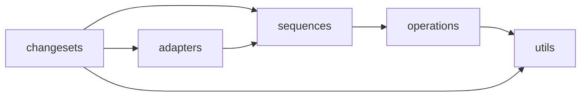
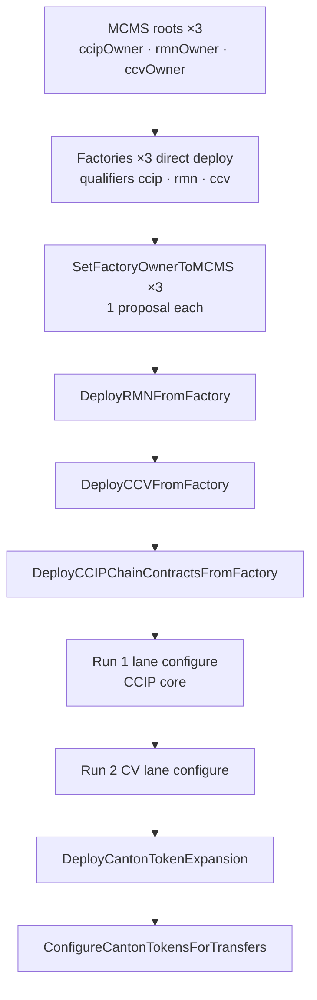

# `deployment/` — navigation guide

For agents and new contributors: how this package is laid out, how control flows, and **rules we follow** when changing deploy/configure code.

Pipeline YAML and proposal execute tooling live in **chainlink-deployments** (`domains/ccv/…`). This repo holds Canton-specific **adapters, sequences, operations, and changeset wrappers**.

**Quick index:** [Layers](#layers-outside--inside) · [Navigate](#how-to-navigate) · [Pipeline order](#pipeline-order--dependencies) · [Rules](#rules--conventions) · [Gotchas](#gotchas--anti-patterns)

---

## Layers (outside → inside)

```
changesets/     Pipeline entry points (ChangeSetV2) — start here from a pipeline name
adapters/       Canton hooks registered into chainlink-ccip registries (init.go)
sequences/      Multi-step workflows; call operations/ in order; return refs + MCMS batches
operations/     One ledger action (one factory choice, one exercise, one deploy)
utils/          datastore lookup, MCMS proposals, contract deploy/exercise primitives
```



| Layer | Start here when… |
|---|---|
| `changesets/` | You know the pipeline/changeset name from YAML |
| `adapters/` | Generic CCIP code calls `Get(FamilyCanton)` — lane deploy, tokens, curse |
| `sequences/` | You need the ordered steps for one workflow |
| `operations/` | You add or fix a single DAML choice |
| `utils/` | MCMS batching, factory/MCMS ref lookup, shared deploy/exercise |

**Registration:** `adapters/init.go` registers Canton into chainlink-ccip at init time.

---

## Directory map

```
deployment/
├── adapters/           # Chain-family, deploy, lane, token, curse, offchain adapters
├── changesets/         # ChangeSetV2 wrappers + direct deploy entry points
├── sequences/          # deploy_chain_contracts_from_factory, configure_chain_for_lanes, token_pools, …
├── operations/
│   ├── ccip/           # factory, onramp, offramp, fee_quoter, rmn_remote, …
│   ├── mcms/           # MCMS contract deploy
│   └── services/eds/   # EDS config
├── utils/
│   ├── datastore/      # factory + MCMS ref lookup, raw instance addresses
│   ├── mcms/           # proposal build, SplitBatchOpsByOwner, qualifiers
│   └── operations/contract/  # NewDeploy, NewExercise, MCMS transaction encoding
├── inputs/staging_testnet/   # Example YAML (copy to chainlink-deployments)
└── loader.go           # EDS metadata on datastore
```

---

## How to navigate

### Three ways in

Pick the entry that matches what you know:

| You have… | Go to… | Then… |
|---|---|---|
| **Pipeline / changeset name** from YAML (e.g. `canton-deploy-ccv-from-factory`) | `changesets/` — grep for the Go type (`DeployCCVFromFactory`) | Read `Apply` → follow `ExecuteSequence` / adapter calls downward |
| **A failing choice or contract** (e.g. `ApplyDestChainConfigUpdates`) | `operations/ccip/<contract>/` — folder name ≈ DAML package | Find `NewExercise` / factory wrapper → grep who calls it in `sequences/` |
| **Generic CCIP behavior** (lane configure, token expansion) | `adapters/init.go` — see which adapter is registered | Open that adapter file → it points at Canton sequences |

If the name starts with **`ConfigureCanton`** or **`DeployCanton`**, it's a **wrapper** in `changesets/` around a chainlink-ccip generic changeset (often pins MCMS to `ccipOwner`).

If the pipeline name is **generic** (`configure-chains-for-lanes-from-topology`, `token_expansion_cross_family`), the logic split is:

- **Generic orchestration** → chainlink-ccip (external module)
- **Canton-specific behavior** → `adapters/` + `sequences/` in this repo

---

### Walk down (pipeline → ledger)

Use this order every time:

```
1. changesets/<name>.go          Apply() — what runs, preconditions, MCMS output
2. adapters/*.go               only if changeset delegates to chain family / deploy adapter
3. sequences/<workflow>.go       ordered steps; search ExecuteOperation calls
4. operations/ccip/<x>/<x>.go  single choice; look for NewExercise / factory Deploy*
5. utils/operations/contract/  deploy.go / exercise.go — direct vs MCMS encode
6. contracts/ccip/.../*.daml   on-ledger truth for choice names & mcmsEntrypoint
```

**Example — factory core deploy:**

```
DeployCCIPChainContractsFromFactory     changesets/deploy_from_factory.go
  → DeployChainContractsFromFactory     sequences/deploy_chain_contracts_from_factory.go
    → factoryops.DeployFeeQuoter        operations/ccip/factory/factory.go
      → contract.NewExercise(...)       utils/operations/contract/exercise.go
```

**Example — lane configure Run 1:**

```
configure-chains-for-lanes-from-topology   (chainlink-ccip v2 changeset)
  → CantonChainFamilyAdapter               adapters/chain_family_adapter.go
    → ConfigureLaneLegAsSourceWithInput      sequences/configure_chain_for_lanes.go
      → fee_quoter.ApplyDestChainUpdates     operations/ccip/fee_quoter/fee_quoter.go
```

---

### Walk up (symptom → caller)

When you land in `operations/` or `sequences/` and need context:

1. **Grep the operation variable** — e.g. `factoryops.DeployFeeQuoter` or `fee_quoter.ApplyDestChainConfigUpdates`
2. Check **`sequences/*.go`** first (closest caller)
3. Check **`changesets/*.go`** and **`adapters/*.go`** for `ExecuteSequence`
4. Check **`integration-tests/`** and **`ccip/devenv/impl.go`** for how devenv invokes the same path

For MCMS/proposal bugs, also walk sideways into **`utils/mcms/`** from the changeset that calls `BuildTimelockProposalForOwner`.

---

### Naming conventions

| Pattern | Location | Meaning |
|---|---|---|
| `DeployCanton*` / `ConfigureCanton*` | `changesets/` | Canton wrapper; often sets MCMS qualifier |
| `deploy_canton_*` / `configure_canton_*` | `changesets/` | file names for the above |
| `deploy_from_factory.go` | `changesets/` | RMN / CV / core split factory deploy + SetOwner |
| `deploy_*_from_factory` | `sequences/` | factory-backed deploy workflow |
| `configure_*_for_lanes` | `sequences/` | lane wiring (onramp/offramp/fq/CV legs) |
| `token_pools.go` | `sequences/` | pool deploy, TAR, rate limiters (multi-op) |
| `operations/ccip/<snake_case>/` | `operations/` | mirrors `contracts/ccip/<package>/` |
| `*_adapter.go` | `adapters/` | implements a chainlink-ccip registry interface |
| `CantonCSDeps[T]` | `changesets/dependencies.go` | wraps config + chainSelector for legacy changesets |

---

### Folder guide

**`changesets/`** — one file ≈ one pipeline step (or wrapper). Skim file top comment + `Apply`. Key files:

| File | Purpose |
|---|---|
| `deploy_from_factory.go` | Factory bootstrap, SetOwner, `DeployRMN/CCV/Core*FromFactory` |
| `deploy_factory_and_set_owner_to_mcms.go` | Legacy combined factory + SetOwner |
| `deploy_mcms.go` | MCMS root deploy (localnet bootstrap) |
| `deploy_canton_chain_contracts.go` | Legacy non-factory deploy via adapter |
| `configure_canton_chains_for_lanes.go` | Single-run dual/triple MCMS lane wrapper (prefer Run 1+2) |
| `configure_canton_committee_verifier_for_lanes.go` | Run 2 CV-only lane configure |
| `deploy_canton_token_expansion.go` | Token pool deploy wrapper |
| `configure_canton_tokens_for_transfers.go` | Token transfer configure wrapper |
| `canton_mcms_preconditions.go` | Shared MCMS ref checks |
| `deploy_lock_release_token_pool.go` | Direct deploy only (devenv/tests) |

**`sequences/`** — read top-to-bottom; each block is an `ExecuteOperation` or helper call:

| File | Purpose |
|---|---|
| `deploy_chain_contracts_from_factory.go` | Core (and optional bundled RMN/CV) via factory |
| `deploy_chain_contracts.go` | Legacy direct deploy sequence |
| `configure_chain_for_lanes.go` | OnRamp/OffRamp/FeeQuoter/GlobalConfig lane legs |
| `configure_committee_verifier_for_lanes.go` | CV remote chain + signature + allowlist |
| `token_pools.go` | Pool factory deploy, rate limiters, TAR, MCMS batching |
| `register_token_pool.go` | TAR registration helpers |

**`operations/ccip/`** — one subfolder per contract family; open the `.go` file for exported `var Deploy` / `var Apply…` operations:

`factory` · `rmn_remote` · `committee_verifier` · `global_config` · `fee_quoter` · `onramp` · `offramp` · `executor` · `token_admin_registry` · `lock_release_token_pool` · `burn_mint_token_pool` · `rate_limiter` · `per_party_router_factory` · `sender` · `receiver`

**`adapters/`** — flat package; **`init.go` is the index**. Largest file: `chain_family_adapter.go` (lane configure). Smaller focused files: `deploy_chain_contracts_adapter.go`, `token_pool_adapter.go`, `curse.go`, `mcms_reader.go`, offchain `*_config_adapter.go`.

**`utils/`** — cross-cutting; jump here when you see import `deployment/utils/...`:

- **`datastore/`** — “how do I find factory/MCMS/ref by qualifier?”
- **`mcms/`** — “how are proposals built/split?”
- **`operations/contract/`** — “what happens on direct submit vs MCMSEnabled?”

---

### What is *not* in this folder

| Concern | Where |
|---|---|
| Pipeline registration (`registry.Add("canton-…")`) | chainlink-deployments `domains/ccv/…/pipelines.go` |
| Generic lane/token changeset logic | chainlink-ccip `deployment/v2_0_0/`, `deployment/tokens/` |
| Durable-pipeline YAML (runtime) | chainlink-deployments `durable_pipelines/` |
| DAML contracts | `contracts/ccip/` in this repo |
| Devenv orchestration (`ccv up`) | `ccip/devenv/impl.go` (outside `deployment/` but calls into it) |

---

### Search tips (for agents)

```bash
# Pipeline name → Go changeset type
rg "DeployCCVFromFactory" deployment/

# Who calls an operation?
rg "factoryops.DeployFeeQuoter" deployment/

# MCMS routing for a choice name
rg "ApplyRemoteChainConfigUpdates" deployment/ contracts/

# All Canton wrapper changesets
rg "^func DeployCanton|^func ConfigureCanton" deployment/changesets/

# ReadAs / proposal mode usage
rg "ReadAsPartyIDs|ProposalDriven|MCMSEnabled" deployment/

# Adapter registration
rg "Register" deployment/adapters/init.go
```

When grepping, prefer **`deployment/`** over the repo root — ignore `.worktree/` and `.worktrees/` copies unless you're on a specific branch worktree.

---

### Decision tree: which layer to edit?

```
New pipeline step or MCMS precondition?
  └─ changesets/ (+ chainlink-deployments pipeline reg)

Generic CCIP calls Canton wrong / missing hook?
  └─ adapters/ (+ init.go if new registry)

Wrong order of deploy/configure steps?
  └─ sequences/

Wrong choice args or missing MCMS encode?
  └─ operations/ccip/<contract>/ (+ exercise EncodeMethod)

Wrong ref lookup / qualifier / raw address?
  └─ utils/datastore/ or utils/mcms/

On-ledger choice missing or wrong mcmsEntrypoint?
  └─ contracts/ccip/.../*.daml (then regenerate bindings)
```

---

## Pipeline order & dependencies

**Golden rule:** generate step N only after step N−1's **on-ledger refs** are in `address_refs.json` (or in-memory datastore for tests). MCMS steps produce proposals — those must **execute** before downstream preconditions pass.



| Phase | Changesets (this repo) | Proposals | Depends on |
|---|---|---|---|
| MCMS bootstrap | `deploy_mcms.go` | 0 (direct) | parties exist |
| Factory deploy | `deploy_from_factory.go` `DeployCCIPFactory` | 0 (direct) | — |
| Factory → MCMS | `SetFactoryOwnerToMCMS` | 1 per factory | matching MCMS ref |
| RMN deploy | `DeployRMNFromFactory` | 1× `rmnOwner` | rmn factory + mcms-rmn |
| CV deploy | `DeployCCVFromFactory` | 1× `ccvOwner` | RMN in datastore |
| Core deploy | `DeployCCIPChainContractsFromFactory` | 1× `ccipOwner` | RMN + CV registry binding |
| Lanes Run 1 | generic v2 + `chain_family_adapter.go` | merged EVM + Canton ccip | core on-ledger |
| Lanes Run 2 | `configure_canton_committee_verifier_for_lanes.go` | 1× `ccvOwner` | **CV on-ledger** |
| Token pool | `deploy_canton_token_expansion.go` | 1× `ccipOwner` | TAR from core + lanes |
| Token configure | `configure_canton_tokens_for_transfers.go` | 1× `ccipOwner` | pool deployed + lanes |

Factory bootstrap (×3) and SetOwner (×3) can be **ordered flexibly among themselves**. Contract deploy **must** stay RMN → CV → core.

---

## Deploy ≠ lane configure

| | **Deploy** (steps 10–12) | **Lane configure** (Run 1 + 2) |
|---|---|---|
| **Purpose** | Create contracts; wire **static** deps into templates | Wire **remote chain** settings on existing contracts |
| **When** | Once per environment bootstrap | After deploy execute; per topology |
| **Examples** | Deploy OnRamp with RMN + CV registry refs baked in | FeeQuoter `ApplyDestChainConfigUpdates`, CV `ApplyRemoteChainConfigUpdates` |
| **MCMS** | One proposal per split deploy changeset | Run 1 → ccipOwner; Run 2 → ccvOwner |

Deploy creates **TokenAdminRegistry** (core). Token **pools** and **rate limiters** are separate token phases — not part of core deploy.

---

## Why RMN → CV → core (hard order)

| Ref needed by | Must exist first | Checked in |
|---|---|---|
| CV template `Deps.RmnRemote` | RMN deployed | `DeployCCVFromFactory` preconditions |
| Core `CcvRegistryBinding` | CV deployed | `DeployCCIPChainContractsFromFactory` |
| OnRamp/OffRamp `Deps.RmnRemote` | RMN deployed | core sequence templates |

On-ledger: creating OnRamp with a missing RMN or CV registry ref **fails at execute time** even if proposal generation succeeded.

---

## Datastore & `ChangesetOutput`

Every changeset returns roughly:

```go
ChangesetOutput{
    DataStore:    // new AddressRefs to merge
    MCMSProposals: // timelock JSON to sign/execute (if proposal-driven)
    Reports:      // operation traces
}
```

**Agent rules:**

1. **Merge** new refs from `DataStore` into `address_refs.json` after direct deploy **or** after MCMS execute.
2. **Preconditions** in later changesets call `utils/datastore/` helpers — missing refs fail at `VerifyPreconditions`, not always at compile time.
3. Lookups are by **`chainSelector` + `type` + `qualifier`** (and sometimes labels for tokens).
4. Prefer **`RawInstanceAddress`** (`instanceId@party`) in MCMS paths; hashed address is derived at ledger boundary.

Key helpers: `FactoryAddressRef`, `ProposerMCMSAddressRef`, `RmnRemoteRawAddress`, fee quoter resolve in `utils/datastore/resolve.go`.

---

## Configure ops by MCMS owner

When debugging “wrong MCMS root” or missing proposals, map the **choice** to the **owner**:

| Owner | Contracts | Example choices |
|---|---|---|
| `ccipOwner` | GlobalConfig, FeeQuoter, OnRamp, OffRamp, Executor, TAR, token pools, rate limiters | `ApplyDestChainConfigUpdates`, `ApplyChainUpdates`, factory `Deploy*` for core |
| `ccvOwner` | CommitteeVerifier | `ApplyRemoteChainConfigUpdates`, `ApplyAllowListUpdates`, `ApplySignatureConfigs`, `DeployCommitteeVerifier` |
| `rmnOwner` | RMNRemote | `Curse`, `Uncurse`, `DeployRMNRemote` |

**Run 1** must not emit CV configure choices (they go to Run 2). In MCMS mode, `configure_chain_for_lanes.go` **skips** CV legs when `ReadAsPartyIDs` is set.

**Routing implementation:** `utils/mcms/dual_proposal.go` — keep `ccvOwnerFunctionNames` / factory substring checks in sync with DAML `mcmsEntrypoint` blocks.

---

## Prod vs localnet paths

| Concern | Localnet / devenv | Staging / prod |
|---|---|---|
| MCMS deploy | `deploy_mcms.go` via `canton-deploy-and-configure-mcms` pipeline | **party-ceremony** (`onboarding` + `contract-deploy`) — not the durable-pipeline MCMS changeset |
| Contract deploy | Often **bundled** via `deploy_chain_contracts_adapter.go` + `DeployRMNInline` | **Split** `DeployRMNFromFactory` → `DeployCCVFromFactory` → `DeployCCIPChainContractsFromFactory` |
| Exercise mode | `ReadAsPartyIDs` empty → direct ledger | `ReadAsPartyIDs` set → proposals only |
| Transfer ownership | N/A (no-op adapter) | N/A (no-op adapter) |

Do **not** use monolithic `DeployCantonChainContracts` or bundled `canton-deploy-chain-contracts` for triple-MCMS prod — use split factory changesets.

---

## MCMS encoding requirements

For an operation to work in proposal mode **all** of the following must hold:

1. Caller sets `MCMSEnabled: true` or sequence sets `ProposalDriven: true`
2. Operation defines `EncodeMethod` in `ExerciseParams` — otherwise exercise errors at runtime
3. `ChoiceInput.RawInstanceAddress` is populated (`instanceId@party`)
4. Changeset collects `ExerciseOutput.Tx` into batch ops and calls `BuildTimelockProposalForOwner` with the **correct owner qualifier**

Direct path uses `LedgerQueryParties(participant)` = ActAs + ReadAs for ACS queries (`exercise.go`).

---

## Gotchas & anti-patterns

| Don't | Do instead |
|---|---|
| Mix CV + CCIP core lane ops in one generic lane run on Canton | Run 1 (no `committeeverifiers`) + Run 2 (CV only) |
| Use `DeployLockReleaseTokenPool` / `DeployBurnMintTokenPool` in MCMS pipelines | `DeployCantonTokenExpansion` + factory path in `token_pools.go` |
| Put rate limiters or `tokenTransferConfig` in pool deploy step | Deploy pool only; configure in `ConfigureCantonTokensForTransfers` |
| Assume same party = same MCMS instance | Use qualifier (`ccipOwner` / `ccvOwner` / `rmnOwner`) — separate instances in datastore |
| Skip RMN deploy before CV/core | Always RMN → CV → core |
| Run CV lane configure before CV deploy execute | Execute step 11 proposal first |
| Edit `ccvOwnerFunctionNames` without checking DAML | Sync with `CommitteeVerifier.daml` `mcmsEntrypoint` |
| Use hashed address in MCMS `TargetInstanceAddress` | Use `RawInstanceAddress` |
| Expect EVM-style transfer/accept ownership on Canton | Ownership in factory template; `transfer_ownership_adapter` is no-op |
| Register Canton wrapper without `WithEnvInput()` in deployments repo | Match existing pipeline patterns in `staging_testnet/pipelines.go` |

**Legacy (avoid for new work):** `ConfigureCantonChainsForLanesFromTopology` (single-run triple split), `deploy_factory_and_set_owner_to_mcms.go` (combined factory+SetOwner), bundled deploy in `deploy_canton_chain_contracts.go`.

---

## Token pool party resolution

In `sequences/token_pools.go`, pool deploy resolves **`ccipOwner`** and pool owner parties from token ref **labels** when `ReadAsPartyIDs` is non-empty:

- Label `ccip-owner` (or instrument labels for Splice tokens) must be present in YAML/input
- When `ReadAsPartyIDs` is empty (devenv), missing label may fall back to participant `PartyID`

Token expansion resolves **existing** Splice instrument refs — it does not mint tokens on ledger.

---

## Bindings & DAML

```
contracts/ccip/<pkg>/daml/*.daml
  → bindings/generated/latest/ccip/<pkg>/   (generated — do not hand-edit)
  → operations/ccip/<pkg>/            (NewExercise / factory encoders use bindings)
```

After DAML changes: `make contracts` (regenerates `latest/` and `current/`). Deployment and operations import `latest/`. To ship an audited release snapshot for external consumers, see **[bindings/README.md](../bindings/README.md)** (`make freeze-release`, `v1_x_y/` trees).

MCMS routing maps must match **`mcmsEntrypoint`** choice names in DAML, not runtime choices like `VerifyMessage`.

---

## Rules & conventions

### 1. `ReadAsPartyIDs` → MCMS / proposal-driven

**Rule:** If the Canton participant has **any** `ReadAsPartyIDs`, exercises run in **proposal mode** (encode choice → MCMS batch op), not direct ledger submit.

```go
mcmsEnabled := len(participant.ReadAsPartyIDs) > 0
// sequences: pass MCMSEnabled or ProposalDriven from this
```

| Mode | When | What happens |
|---|---|---|
| **Direct** | `ReadAsPartyIDs` empty (typical devenv / integration tests) | `Exercise` submits to ledger immediately; refs land in output datastore |
| **Proposal-driven** | `ReadAsPartyIDs` non-empty (staging/prod operator) | `MCMSEnabled: true` → encode only, return `ExerciseOutput.Tx`; changeset builds timelock proposal |

Used in: `utils/operations/contract/exercise.go`, `sequences/token_pools.go`, `changesets/deploy_from_factory.go` (`ProposalDriven = len(ReadAsPartyIDs) > 0`).

Devenv/tests that must deploy directly: keep participant **without** ReadAs rights, or set `MCMSEnabled: false` explicitly where supported.

---

### 2. Factory-based deployment (preferred path)

**Rule:** Production deploy goes through **CCIPFactory** choices, not ad-hoc `NewDeploy` per contract in MCMS pipelines.

Pattern per domain:

```
DeployCCIPFactory (direct, no proposal)
  → SetFactoryOwnerToMCMS (1× MCMS proposal per factory)
  → Deploy*FromFactory (1× MCMS proposal per changeset)
```

| Factory qualifier | `utils/datastore/factory.go` | MCMS qualifier | Deploy changeset |
|---|---|---|---|
| `ccip` | `QualifierCCIP` | `ccipOwner` | `DeployCCIPChainContractsFromFactory` (core only) |
| `ccv` | `QualifierCCV` | `ccvOwner` | `DeployCCVFromFactory` |
| `rmn` | (rmn factory ref) | `rmnOwner` | `DeployRMNFromFactory` |

**Deploy order (contract MCMS deploys):** RMN → CommitteeVerifier → core. CV templates need RMN ref; core needs CV registry ref.

**Split vs bundled:**

| Path | When | Entry |
|---|---|---|
| **Split** (prod) | One MCMS root per owner | `changesets/deploy_from_factory.go` — separate changesets per domain |
| **Bundled** (devenv) | All-in-one local bootstrap | `adapters/deploy_chain_contracts_adapter.go` → `sequences/deploy_chain_contracts_from_factory.go` with inline RMN |

Core factory deploy **excludes** RMNRemote and CommitteeVerifier — those are separate changesets on prod.

---

### 3. Triple MCMS (three instances, three qualifiers)

**Rule:** Same ledger party may act as multiple owners, but tooling treats **three separate MCMS instances** in the datastore:

| Qualifier | Instance | Owns |
|---|---|---|
| `ccipOwner` | `mcms-ccip` | GlobalConfig, FeeQuoter, OnRamp/OffRamp, TAR, token pools, rate limiters, lane core |
| `rmnOwner` | `mcms-rmn` | RMNRemote deploy, curse/uncurse |
| `ccvOwner` | `mcms-ccv` | CommitteeVerifier deploy + CV lane configure |

Constants: `utils/mcms/qualifiers.go`. Lookup: `utils/datastore/mcms.go`. Preconditions: `changesets/canton_mcms_preconditions.go` (`requireTripleMCMSRefs`).

Canton wrapper changesets **pin** MCMS qualifier (e.g. `DeployCantonTokenExpansion` forces `ccipOwner`).

---

### 4. Proposal routing (`SplitBatchOpsByOwner`)

**Rule:** When one batch mixes owners, split before building proposals — `utils/mcms/dual_proposal.go`.

Routing signals (first match wins):

- `ContractType` (e.g. `CommitteeVerifier`)
- Factory target address contains `ccip-factory-ccv@` / `ccip-factory-rmn@`
- MCMS `FunctionName` in maps synced with DAML `mcmsEntrypoint` (`CommitteeVerifier.daml`, `RMNRemote.daml`)

Production lane configure avoids mixed batches by using **Run 1 + Run 2** (below) instead of splitting a single run.

---

### 5. Lane configure — Run 1 + Run 2

**Rule:** Do not configure CV lane ops through the generic lane changeset on Canton when triple MCMS is in play — CV ops belong on `mcms-ccv`.

| Run | What | MCMS | Entry |
|---|---|---|---|
| **Run 1** | CCIP core lanes (GlobalConfig, FeeQuoter, OnRamp/OffRamp, Executor) | `ccipOwner` | Generic `configure-chains-for-lanes-from-topology` → `adapters/chain_family_adapter.go` |
| **Run 2** | CommitteeVerifier only (`ApplyRemoteChainConfigUpdates`, signatures, allowlist) | `ccvOwner` | `changesets/configure_canton_committee_verifier_for_lanes.go` |

Run 1: omit CV from Canton chain input. Run 2: custom chain-family registry delegates only to `sequences/configure_committee_verifier_for_lanes.go`.

Fee quoter refs: resolve from datastore (`adapters/configure_lanes_datastore.go`, `utils/datastore/resolve.go`).

---

### 6. Token pools — deploy vs configure (two steps)

**Rule:** Split token work into pool deploy and transfer wiring; rate limiters come at **configure**, not pool deploy.

| Step | Changeset | Omit / include |
|---|---|---|
| Pool deploy | `DeployCantonTokenExpansion` | `deployTokenPoolInput` only — **no** `tokenTransferConfig` |
| Transfer configure | `ConfigureCantonTokensForTransfers` | TAR registration + rate limiter deploys + pool `ApplyChainUpdates` in **one** `ccipOwner` proposal |

Underlying sequence: `sequences/token_pools.go` (factory pool deploy, MCMS batching, party resolution from token ref labels).

**Do not** use `DeployLockReleaseTokenPool` / `DeployBurnMintTokenPool` changesets in MCMS pipelines — they don't emit proposals. OK for devenv direct deploy.

---

### 7. Ownership & transfer adapter

**Rule:** Canton does **not** use EVM Ownable2Step + timelock accept. `ccipOwner` / `rmnOwner` / `ccvOwner` are set in factory templates at deploy time.

`adapters/transfer_ownership_adapter.go` is a **no-op** satisfying the cross-family interface.

---

### 8. Raw instance addresses

**Rule:** Carry `RawInstanceAddress` (`instanceId@party`) through deploy/configure; derive hashed `InstanceAddress` only at adapter/ledger boundaries.

- MCMS `AdditionalFields.TargetInstanceAddress` requires raw form
- `utils/datastore/raw_instance_address.go`, `ChoiceInput.RawInstanceAddress` in `exercise.go`

---

### 9. What deploy includes (and excludes)

| Phase | On ledger | Not here |
|---|---|---|
| Core factory deploy | GlobalConfig, TAR, FeeQuoter, OnRamp, OffRamp, Executors, PPR factory | Token pools, rate limiters |
| RMN factory deploy | RMNRemote | — |
| CV factory deploy | CommitteeVerifier(s) | — |
| Token expansion | Token pool contract via factory | TAR register, rate limiters (step 2) |

---

## Call stack (typical MCMS path)

```
Pipeline YAML
  → changesets.X.Apply
      → adapter or sequence (ExecuteSequence)
          → operations (ExecuteOperation)
              → contract.NewExercise / factory choice
                  → if MCMSEnabled: encode → ExerciseOutput.Tx
                  → else: direct ledger submit
      → utils/mcms BuildTimelockProposalForOwner
  → ChangesetOutput { DataStore, MCMSProposals }
```

Empty batch for an owner → `errNoBatchOps` (no proposal for that root).

---

## Key files by task

| Task | Start here |
|---|---|
| New pipeline step | `changesets/` + register in chainlink-deployments |
| Factory deploy / split RMN·CV·core | `changesets/deploy_from_factory.go`, `sequences/deploy_chain_contracts_from_factory.go` |
| Factory choice implementation | `operations/ccip/factory/factory.go` |
| Lane configure (Run 1) | `adapters/chain_family_adapter.go` → `sequences/configure_chain_for_lanes.go` |
| Lane configure (Run 2 CV) | `changesets/configure_canton_committee_verifier_for_lanes.go` |
| MCMS routing / split | `utils/mcms/dual_proposal.go` (+ DAML `mcmsEntrypoint`) |
| Token pool MCMS | `sequences/token_pools.go`, `changesets/deploy_canton_token_expansion.go` |
| Token transfer configure | `changesets/configure_canton_tokens_for_transfers.go` |
| MCMS / factory ref lookup | `utils/datastore/mcms.go`, `utils/datastore/factory.go` |
| New contract operation | `operations/ccip/<contract>/` → wire into a sequence |
| Adapter registration | `adapters/init.go` |
| Devenv wiring | `ccip/devenv/impl.go` |
| Example YAML | `inputs/staging_testnet/` |

---

## Tests

| Area | Location | Notes |
|---|---|---|
| MCMS owner split | `utils/mcms/dual_proposal_test.go` | Routing maps for cv/rmn/ccip |
| Changesets / sequences | `*_test.go` next to source | |
| MCMS changeset | `integration-tests/mcms/` | |
| CCIP send + tokens | `integration-tests/ccip/` | Often direct deploy (no ReadAs) |
| Devenv full stack | `ccip/devenv/impl.go` | Bundled factory path, `MCMSEnabled: false` where needed |

When integration tests call lane configure directly, they must pass a **datastore** with refs wired (`ConfigureLaneLegAsSourceWithInput` + `DataStore` field).

---

## External dependencies

| Repo | Role |
|---|---|
| **chainlink-ccip** | Generic v2 changesets, adapter interfaces, token/lane topology |
| **chainlink-deployments-framework** | Environment, operations bundle, datastore, Canton chain type |
| **chainlink-deployments** | Pipeline names, durable-pipeline YAML, proposal execute |
| **contracts/** (this repo) | DAML — source of truth for MCMS entrypoint names and factory choices |
