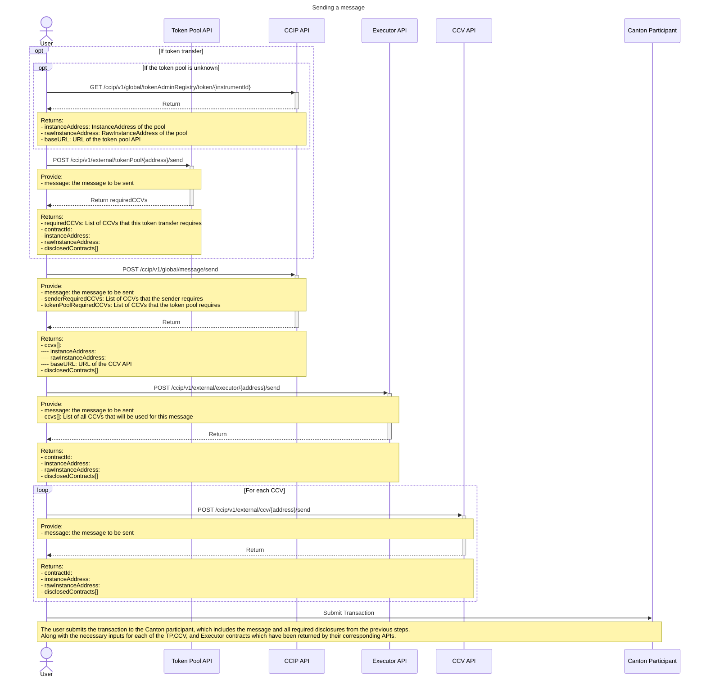
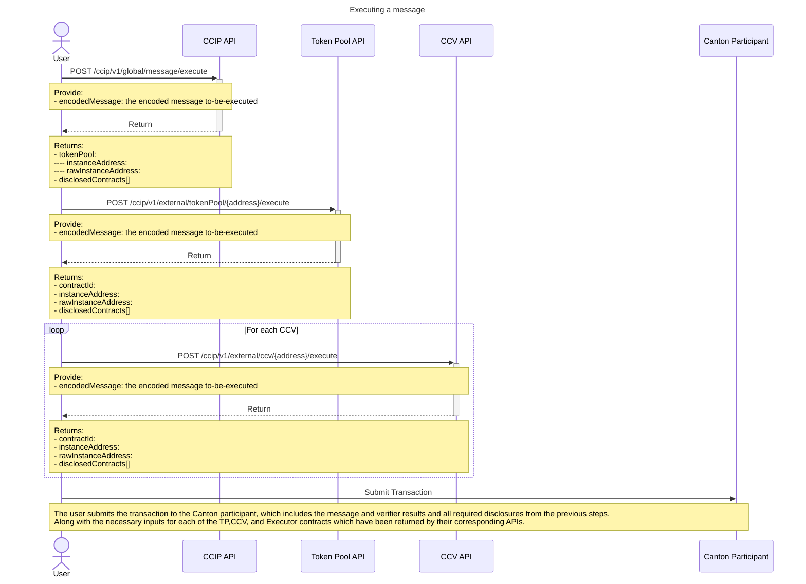

# CCIP Explicit Disclosure APIs

Since users are required to interact with contracts that they're not a stakeholder of, Explicit Disclosure APIs are
provided to users in order to grant them access. Users are required to query these APIs before sending/executing
messages.

While some of these APIs will be run by Chainlink Labs, **in the case of third-party token pools / CCVs / Executors, the
operator of these is required to run their own API and make it available to users.**

## Available APIs

### Global CCIP API

The Global CCIP API provides endpoints for users to query explicit disclosures for the global CCIP contracts, such as:

- FeeQuoter
- OnRamp
- OffRamp
- PerPartyRouterFactory
- RMNRemote
- TokenAdminRegistry

This API is only run by Chainlink Labs, and is made available for all users.

#### PerPartyRouterFactory

> Endpoint: `POST /ccip/v1/global/perPartyRouter/factory`

This endpoint allows users to get an explicit disclosure for the CCIP per-party-router-factory.

It is required for a party to instantiate a per-party-router, which is required for sending and executing messages via
CCIP.

#### Look up a Token Pool on the Token Admin Registry

> Endpoint: `GET /ccip/v1/global/tokenAdminRegistry/token/{instrumentId}`

This allows the user to look up a token pool for a given instrument.

If the provided Instrument has a registered token pool, the API will return the instance address of the token pool.

If the token pool's operator has registered and API endpoint with the global EDS registry, then this will also return
the base URL for the token pool's API, which can be used to query for explicit disclosures from the token pool.

#### Send

> Endpoint: `POST /ccip/v1/global/message/send`

This endpoint allows the user to query the necessary disclosures for sending a message via CCIP.

#### Execute

> Endpoint: `POST /ccip/v1/global/message/execute`

This endpoint allows the user to query the necessary disclosures for executing a message via CCIP.

### Token Pool API

The Token Pool API is provided and ran by the operator of a token pool, and provides endpoints for users to query
explicit disclosures for a specific token pool contract.

#### Send

> Endpoint: `POST /ccip/v1/external/tokenPool/{address}/send`

Send accepts the outgoing message including a token transfer.

It returns the necessary disclosures and inputs for the token pool, as well as a list of required CCVs that this token
transfer requires, which the user will need to query before actually sending the message.

#### Execute

> Endpoint: `POST /ccip/v1/external/tokenPool/{address}/execute`

Execute accepts the encoded message that is to-be-executed on Canton.

It returns the necessary disclosures and input for the token pool.

### CCV API

The CCV API is provided and ran by the operator of a CCV, and provides endpoints for users to query explicit disclosures
for a specific CCV contract.

#### Send

> Endpoint: `POST /ccip/v1/external/ccv/{address}/send`

Send accepts the outgoing message, as well as a list of all CCVs that the sender and token pool require for this
message.

It returns the necessary disclosures and inputs for the CCV.

#### Execute

> Endpoint: `POST /ccip/v1/external/ccv/{address}/execute`

Execute accepts the encoded message that is to-be-executed on Canton.

It returns the necessary disclosures and inputs for the CCV.

### Executor API

The Executor API is provided and ran by the operator of an Executor, and provides endpoints for users to query explicit
disclosures for a specific Executor contract.

#### Send

> Endpoint: `POST /ccip/v1/external/executor/{address}/send`

Send accepts the outgoing message, as well as a list of all CCVs that the sender and token pool require for this
message.

It returns the necessary disclosures and inputs for the Executor.

#### Execute

The Executor provides no API for execution, as it has no contract involved in the execution of a message on the
destination chain.

## Sending a message

### Overview

Sending a message from Canton requires the following API calls:

1. (If the message includes as token transfer) The user needs to query the token pool API for the token's token pool to
   get the token pool disclosures along with a list of required CCVs for this token transfer.
    1. If the token pool is unknown, the user needs to query the global CCIP API to look up the token pool for the
       token from the Token Admin Registry.
2. The user needs to query the global CCIP API to get the disclosures for sending a message, providing the list of
   required CCVs from the previous step along with any sender-required CCVs that the sender-contract might require.
    1. The global CCIP API will return the disclosures for sending a message
    2. Along with an aggregated list of all CCVs that are required for this message (this includes the sender-required
       CCVs, token-pool-required CCVs, and any default/lane-mandates CCVs that the global CCIP API determines are
       required for this message based on the message content and the provided lists of required CCVs).
    3. If an Executor has been requested/specified for the message, then the global CCIP API will also return the
       address of the Executor contract.
3. The user needs to query the Executor API to get the disclosures for the Executor, providing the list of all CCVs that
   were returned by the previous step.
    1. The Executor API accepts a list of CCVs along with the message, as an Executor can limit the CCVs that can be
       used with it. This allows the Executor to provide disclosures based on the specific CCVs that will be used with
       this message or reject the request if the provided CCVs are not compatible with this Executor.
4. The user needs to query the CCV API for each CCV that was returned by the global CCIP API.
5. The user submits the transaction to the Canton participant, which includes the message and all required disclosures
   from the previous steps, along with the necessary inputs for each of the TP,CCV, and Executor contracts which have
   been returned by their corresponding APIs.

### Diagram

## Executing a message

### Overview

Executing a message on Canton requires the following API calls:

1. The user queries the global CCIP API, providing the encoded message itself and a list of addresses of all CCVs that
   have verified this message.
    1. The global CCIP API will return the disclosures for all global CCIP contracts that are relevant for execution
    2. If the message contains a token transfer, it will also return the Token Pool that's registered for the token
       being transferred.
2. The user needs to query the token pool API for the token pool of the transferred token, providing the encoded
   message.
3. The user needs to query the CCV API for each CCV that verified this message to get the disclosures for execution,
   providing the encoded message to each CCV API.
4. The user submits the transaction to their Canton participant, which includes the message and all required disclosures
   from the previous steps, along with the necessary inputs for each of the TP and CCV contracts which have been
   returned by their corresponding APIs.

### Diagram

## EDS URL Discovery

This standard expects third-party operators of Token Pools, CCVs, and Executors to run their own APIs for their
contracts, which users can query to get the necessary disclosures. In order for a user to be able to query these APIs,
they need to know the API URL endpoint for these contracts.

To determine the correct endpoint to query for a specific contract, users should inspect the `RawInstanceAddress` of a
contract which is in the form of `prefix@{ownerParty}`. Where each `ownerParty` indicates a different API endpoint to
query for disclosures related to this contract. The mapping of `ownerParty` to API endpoint has to be done off-ledger by
the user.

In order to facilitate this mapping, operators of third-party contracts are expected to create a CNS entry for their
party, with the key being `ccip.chain.link/edsUrls` and the value being a comma-separated list of URLs.
